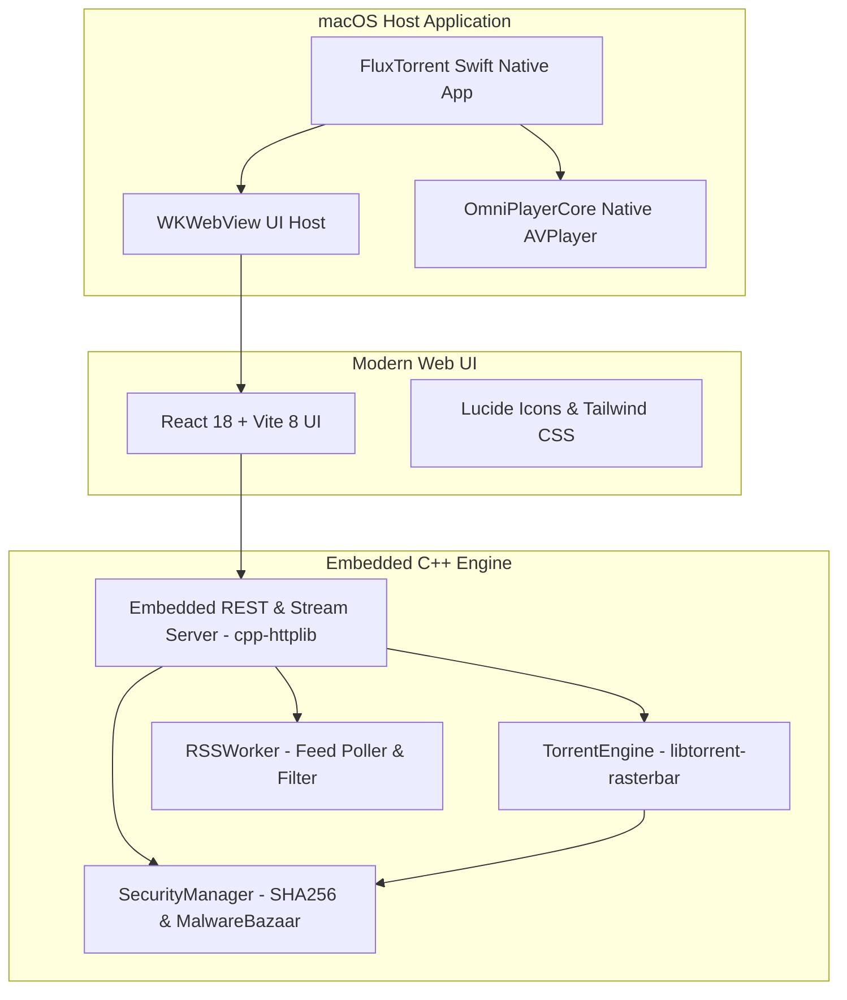

# OmniFlux — High-Performance Torrent Client

<div align="center">


### A modern, secure, high-performance BitTorrent client for macOS powered by native C++ and Swift.

[](https://github.com/abhishekdutta18/TorrentDownloader/actions/workflows/cpp-ci.yml)
[](https://github.com/abhishekdutta18/TorrentDownloader/actions/workflows/codeql.yml)
[-black?logo=apple)](https://github.com/abhishekdutta18/TorrentDownloader)
[](https://libtorrent.org/)
[](https://react.dev/)
[](LICENSE)
[](postman/OmniFlux.postman_collection.json)

[Features](#-key-features) • [Architecture](#-architecture) • [Installation](#-installation) • [Build from Source](#-building-from-source) • [Security](#-integrated-security--threat-protection) • [API & Postman](#-rest-api-reference)

</div>

---

## 📖 Overview

**OmniFlux** is an open-source BitTorrent client crafted specifically for performance, safety, and a seamless native user experience. Built completely without heavy Electron runtimes, OmniFlux couples a native **C++17 libtorrent-rasterbar** core with a lightweight **macOS Swift** container, an embedded streaming server, and an ultra-responsive **React + Tailwind CSS** frontend.

OmniFlux also features an **integrated anti-malware threat intelligence system** that scans payloads in real time, queries the **MalwareBazaar** cloud database via SHA-256 signatures, detects high-risk executable extensions, and automatically tags files with macOS quarantine attributes (`com.apple.quarantine`).

---

## 🚀 Key Features

| Feature | Description |
| :--- | :--- |
| **⚡ Native libtorrent Core** | Full BitTorrent v1 & v2 protocol implementation with DHT, PEX, LSD, NAT-PMP, UPnP, and fast resume serialization. |
| **🛡️ Real-Time Malware Defense** | Inspects torrent payloads before and during downloads. Identifies high-risk executables (`.exe`, `.scr`, `.bat`, `.vbs`, etc.) and performs online reputation lookups against MalwareBazaar. |
| **🏷️ macOS Quarantine Tagging** | Automatically tags suspicious downloads with `com.apple.quarantine` attributes so macOS Gatekeeper protects you before execution. |
| **🎬 Media Streaming & Playback** | Stream video and audio torrents sequentially with on-the-fly HTTP byte-range seek support. Includes in-app playback and native macOS AVPlayer (`OmniPlayerCore`) fallback. |
| **🔍 Multi-Provider Torrent Search** | Search across leading public torrent repositories directly from the app. Instant sorting by seeders, leechers, file size, and upload date. |
| **📡 Automated RSS Downloads** | Subscribe to your favorite torrent RSS feeds and configure custom RegEx filters to automatically download new matching items. |
| **🎛️ Bandwidth & Ratio Management** | Fine-grained global and per-torrent download/upload speed limits, sequential downloading toggle, and seeding ratio controls. |
| **🧲 Smart Magnet Interception** | Instant magnet URL normalization, info hash auto-detection (hex and base32), and automatic clipboard monitoring. |
| **🎨 Sleek Native Design** | Dark mode UI with macOS native traffic-light integration, live status indicators, file priority selectors, and tab-level badge counts. |

---

## 🏗 Architecture

OmniFlux is architected into three decoupled, high-performance layers:



- **Frontend (`src/`)**: Written in React 18, TypeScript, and Vite. Handles user interactions, instant filtering, torrent additions, and settings configuration. Communicates with the engine over local REST endpoints.
- **Engine (`cpp/`)**: High-throughput C++17 daemon embedding `libtorrent-rasterbar`. Implements the state machine, disk I/O, network peers, security scanner, and HTTP streaming server on `localhost:8080`.
- **macOS Container (`FluxTorrent/`)**: Pure Swift native macOS application managing the system window lifecycle, traffic-light bar, native file dialogs, and AVPlayer media playback.

---

## 🛡 Integrated Security & Threat Protection

BitTorrent downloads often carry risks of disguised trojans, ransomware, or malicious executables. OmniFlux protects users with an active 4-tier security pipeline:

1. **Pre-Download File Extension Heuristics**: Identifies executable, script, and screensaver payloads (`.exe`, `.scr`, `.bat`, `.cmd`, `.vbs`, `.js`, `.pif`).
2. **Auto-Skip Dangerous Files**: When enabled in Settings, dangerous executable files within multi-file torrents are automatically set to priority 0 (skipped) while allowing media/docs to download safely.
3. **MalwareBazaar Cloud Hash Lookup**: Checks completed file SHA-256 hashes against abuse.ch MalwareBazaar's real-time malware intelligence API.
4. **macOS Quarantine Tagging**: Suspicious or downloaded executable files receive native `com.apple.quarantine` extended attributes (`setxattr`), triggering macOS Gatekeeper verification upon any launch attempt.

---

## 📦 Installation

### Pre-Built macOS App
1. Download the latest release from the [Releases](https://github.com/abhishekdutta18/TorrentDownloader/releases) page.
2. Drag and drop **OmniFlux.app** into your `/Applications` directory.
3. *(First Run)* If prompted with an unsigned app notice from macOS Gatekeeper:
   ```bash
   xattr -cr "/Applications/OmniFlux.app"
   ```
4. Launch **OmniFlux** and start downloading!

---

## 🛠 Building from Source

### Prerequisites

Ensure the following tools are installed on your macOS system:
- **macOS 12.0+** with **Xcode Command Line Tools**:
  ```bash
  xcode-select --install
  ```
- **Homebrew** packages:
  ```bash
  brew install cmake libtorrent-rasterbar xcodegen node
  ```

### Build Instructions

1. **Clone the repository**:
   ```bash
   git clone https://github.com/abhishekdutta18/TorrentDownloader.git
   cd TorrentDownloader
   ```

2. **Install frontend dependencies**:
   ```bash
   npm ci
   ```

3. **Build and test the native C++ engine**:
   ```bash
   cmake -B cpp/build -S cpp
   cmake --build cpp/build -j4
   (cd cpp/build && ctest --output-on-failure)
   ```

4. **Build the complete macOS application bundle**:
   ```bash
   bash build_app.sh
   ```
   The compiled **OmniFlux.app** will be generated in `build/` and copied to `~/Desktop/OmniFlux.app`.

---

## 🧪 Testing & Quality Assurance

OmniFlux maintains automated CI and validation tests across both the C++ backend and the React frontend:

| Component | Command | Coverage |
| :--- | :--- | :--- |
| **C++ Engine Tests** | `npm run test:cpp` | Engine initialization, magnet parsing, torrent file loading, pause/resume, thread safety, multi-source search parsing, security extension detection, and SHA-256 calculations. |
| **UI & Type Validation** | `npm test` | TypeScript type-checking (`tsc --noEmit`), JSX string literal newline verification, and Vite production bundle compilation. |
| **API Integration Tests** | `npm run test:api` | Automated end-to-end REST API assertions via **Newman** against the Postman collection suite. |
| **Code Linting** | `npm run lint` | ESLint rules for React Hooks and React Refresh. |

---

## 🔌 REST API Reference

OmniFlux's embedded C++ backend exposes a high-performance HTTP REST API on `http://localhost:8080`:

### Torrent Management
| Method | Endpoint | Description |
| :--- | :--- | :--- |
| `GET` | `/api/torrents` | List all active torrents with download/upload rates, progress, peers, and file metadata. |
| `POST` | `/api/torrents` | Add a torrent from magnet link, raw info hash, or HTTP URL (`{"magnet": "..."}`). |
| `POST` | `/api/torrents/file` | Upload and parse a `.torrent` file payload via `multipart/form-data`. |
| `POST` | `/api/torrents/:hash/pause` | Pause download and upload for a specific torrent. |
| `POST` | `/api/torrents/:hash/resume` | Resume a paused torrent. |
| `POST` | `/api/torrents/:hash/stop` | Stop transfers without removing from session. |
| `POST` | `/api/torrents/pause_all` | Batch pause all active torrents. |
| `POST` | `/api/torrents/resume_all` | Batch resume all torrents. |
| `POST` | `/api/torrents/stop_all` | Batch stop all active torrents. |
| `POST` | `/api/torrents/:hash/sequential` | Toggle sequential piece downloading for media streaming (`{"sequential": true}`). |
| `POST` | `/api/torrents/:hash/open_folder` | Reveal download folder in macOS Finder (`open -R`). |
| `DELETE` | `/api/torrents/:hash?delete_files={bool}` | Remove torrent with optional file deletion from disk. |

### Files, Security & Streaming
| Method | Endpoint | Description |
| :--- | :--- | :--- |
| `GET` | `/api/torrents/:hash/files` | List individual files, byte progress, priorities, SHA-256, and MalwareBazaar ratings. |
| `POST` | `/api/torrents/:hash/files` | Set file priorities: `0` (skip), `1` (normal), `7` (high) (`{"priorities": [...]}`). |
| `POST` | `/api/torrents/:hash/files/:index/scan` | Trigger asynchronous SHA-256 calculation and MalwareBazaar reputation lookup. |
| `POST` | `/api/torrents/:hash/files/:index/play_external` | Launch file directly in system default media player. |
| `GET` | `/api/stream/:hash/:index` | HTTP 206 Partial Content byte-range streaming for video and audio playback. |

### Swarm, Trackers & Diagnostics
| Method | Endpoint | Description |
| :--- | :--- | :--- |
| `GET` | `/api/session/stats` | Real-time session statistics (DHT nodes, global transfer rates, peer counts, disk queues). |
| `GET` | `/api/torrents/:hash/pieces` | Piece bitfield map and swarm piece availability. |
| `GET` | `/api/torrents/:hash/peers` | Connected swarm peers with IP, client identification, and transfer rates. |
| `GET` | `/api/torrents/:hash/trackers` | List registered trackers with seeder/leecher counts and announce statuses. |
| `POST` | `/api/torrents/:hash/trackers` | Add a new announce tracker URL to the swarm (`{"url": "..."}`). |
| `POST` | `/api/torrents/:hash/reannounce` | Force immediate tracker reannounce. |

### Search & Settings
| Method | Endpoint | Description |
| :--- | :--- | :--- |
| `GET` | `/api/search?q={query}` | Perform concurrent Jackett & DHT search with Server-Sent Events (SSE) streaming. |
| `GET` | `/api/settings` | Retrieve global bandwidth limits, download directory, and security toggles. |
| `POST` | `/api/settings` | Update global settings (`~/.fluxtorrent/settings.json`). |

### Local AI & Media Intelligence
| Method | Endpoint | Description |
| :--- | :--- | :--- |
| `POST` | `/api/ai/parse_media` | Parse raw scene release strings into title, year, season, episode, quality, codec, and clean Plex filenames. |
| `GET` | `/api/torrents/:hash/media_ai` | Run AI scene detection and auto-renaming suggestions on all files in a torrent. |

---

## 🤖 *Arr Automation Integration (Sonarr, Radarr, Prowlarr)

OmniFlux exposes an embedded **qBittorrent Web API v2** compatibility layer (`/api/v2/*`). This allows popular media automation services (**Sonarr**, **Radarr**, **Prowlarr**, **Overseerr**) to treat OmniFlux as a native qBittorrent client with zero extra bridges or wrappers!

### Setup in Sonarr / Radarr:
1. Open **Settings** > **Download Clients** > **Add (+)**.
2. Select **qBittorrent**.
3. Configure the connection:
   - **Host**: `localhost` (or your Mac's LAN IP if running in Docker/VM)
   - **Port**: `8080`
   - **Username**: `admin`
   - **Password**: `adminadmin` (or any string)
   - **Use SSL**: Disabled
4. Click **Test** — Sonarr/Radarr will handshake with `GET /api/v2/app/webapiVersion` and authenticate via `POST /api/v2/auth/login`.
5. Save. Downloads and queue monitoring will now synchronize seamlessly!

### Supported qBittorrent v2 Endpoints:
| Method | Endpoint | Purpose |
| :--- | :--- | :--- |
| `GET` | `/api/v2/app/version` | Handshake application version string (`v4.6.0`). |
| `GET` | `/api/v2/app/webapiVersion` | Handshake Web API version (`2.9.3`). |
| `POST` | `/api/v2/auth/login` | Session handshake returning `SID` cookie. |
| `POST` | `/api/v2/auth/logout` | Invalidate session cookie. |
| `GET` | `/api/v2/transfer/info` | Global download/upload rates and connection status. |
| `GET` | `/api/v2/torrents/info?filter=all` | Queue monitoring with torrent progress, state, speeds, and sizes. |
| `POST` | `/api/v2/torrents/add` | Enqueue torrent via magnet URLs or multipart torrent files. |
| `POST` | `/api/v2/torrents/pause` | Pause torrents by pipe-separated hash (`hashes=hash1\|hash2`) or `all`. |
| `POST` | `/api/v2/torrents/resume` | Resume torrents by hash or `all`. |
| `POST` | `/api/v2/torrents/delete` | Delete torrent with optional disk data removal (`deleteFiles=true`). |
| `GET` | `/api/v2/torrents/files?hash={hash}` | Torrent file list with byte progress and priority levels. |
| `GET` | `/api/v2/torrents/trackers?hash={hash}` | Swarm announce URLs and peer metrics. |

---

## 📬 Postman API Collection & Testing

A complete Postman workspace is included in the [`postman/`](postman/) directory:

* **Collection**: [`postman/OmniFlux.postman_collection.json`](postman/OmniFlux.postman_collection.json) (Postman v2.1.0 specification with 100% endpoint coverage, pre-request scripts, and JavaScript test assertions).
* **Environment**: [`postman/OmniFlux_Local.postman_environment.json`](postman/OmniFlux_Local.postman_environment.json) (Pre-configured local variables).

### 🚀 Quickstart with Postman

1. Open the **Postman** desktop application or web workspace.
2. Click **Import** and select:
   * `postman/OmniFlux.postman_collection.json`
   * `postman/OmniFlux_Local.postman_environment.json`
3. Select the **OmniFlux Local Environment** in the top-right environment selector.
4. Start your local OmniFlux backend or daemon (`./build/OmniFluxServer` or `npm run dev`).
5. Execute requests interactively or click **Run collection** to run the complete test suite.

### 🤖 Headless CLI Testing with Newman

You can run automated integration and regression test suites from the command line or CI without opening Postman:

```bash
# Run tests against local daemon
npm run test:api

# Or run Newman directly with custom parameters
npx newman run postman/OmniFlux.postman_collection.json \
  -e postman/OmniFlux_Local.postman_environment.json \
  --reporters cli
```

---

## 🤝 Contributing

Contributions are welcome! To get started:
1. Fork the repository.
2. Create your feature branch (`git checkout -b feature/awesome-feature`).
3. Commit your changes (`git commit -m 'feat: add awesome feature'`).
4. Ensure all tests pass (`npm test` and `npm run test:cpp`).
5. Push to your branch and open a Pull Request.

---

## 📄 License

This project is licensed under the MIT License - see the [LICENSE](LICENSE) file for details.
